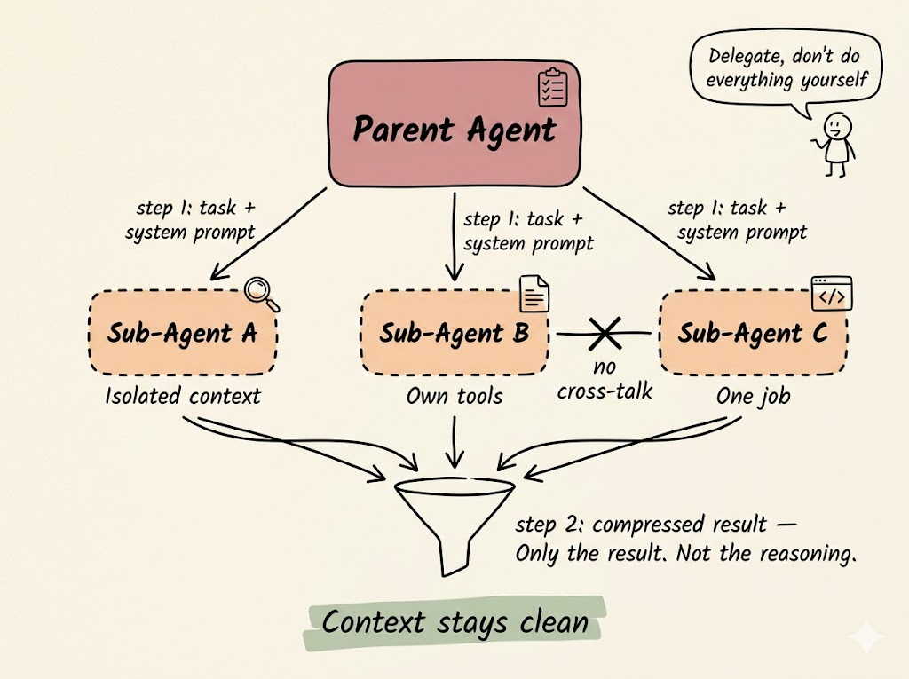

# handdrawn-infographic

一个 Claude Code Skill：把结构化文字（大纲、概念讲解、对比、模式清单、流程、Agent 架构等）转成手绘白板风格的信息图。

两阶段工作流：先产出 **布局方案 + 图像 Prompt** 给你确认，确认后才调用 Gemini 生图（或只交付 Prompt 自己生）。

## 视觉锚点

- **背景**：暖色奶油纸（`#F5F1E8`），带淡淡纸纹
- **线条**：手绘黑墨水，带抖动，圆角矩形
- **配色**：muted pastel —— dusty rose / lavender / sage green / baby blue / peach / soft yellow（不饱和、不霓虹、不渐变）
- **高亮**：关键句用 sage-green 或 soft-yellow 手绘荧光块
- **箭头**：单笔手绘带小三角箭头；虚线表示隔离；X 表示禁止路径
- **图标**：黑色线描小 doodle（链条、分叉、奖杯、放大镜、齿轮……）
- **可选彩蛋**：火柴人 + 对话气泡，承载一句「道理」

## 六种布局原型

决策顺序：**metaphor → radial → progression → 1 → 2 → 3–6**。

| 原型 | 何时用 |
|---|---|
| **Metaphorical illustration** | 文本以具象隐喻为骨架（脚手架、花园、冰山、工厂） |
| **Concentric radial** | 结构围绕中心向外展开（core → ring → ring） |
| **Progression strip** | 同一结构在 3–4 个阶段演化（turn 1 → 2 → 3） |
| **Single-scene** | 讲透一个机制 / 流程 |
| **Comparison** | 2 个对立方案 / 顺序两阶段（sub-variant：Phase 1 → Phase 2 with handoff） |
| **Grid** | 3–6 个并列模式 / 原则 |

详见 `references/layout-archetypes.md`。

## 用法

在 Claude Code 里直接描述你要画的东西，比如：

> 把这段文字画成手绘信息图：「Parent agent delegates tasks to sub-agents in parallel. Each sub-agent has isolated context, its own tools, one job. They don't talk to each other. Results funnel back as compressed summaries so the parent context stays clean.」

Skill 会先给你：
1. 选定的布局原型 + 一句理由
2. ASCII 布局草图
3. 每个卡片的颜色角色清单
4. 完整的英文 image prompt

确认后再出图，或者只要 prompt 自己拿去生。

## 示例

**输入**：

> 把这段文字画成手绘信息图：「Parent agent delegates tasks to sub-agents in parallel. Each sub-agent has isolated context, its own tools, one job. They don't talk to each other. Results funnel back as compressed summaries so the parent context stays clean.」

**Skill 的布局方案**：

- **原型**：`single-scene` — 文本讲的是一个机制（父代理并行分派 + 结果汇流），有明确层级和流向
- **标题**：跳过（火柴人气泡已承载"道理"）

ASCII 草图：

```
                    ┌────────────────────┐
                    │   Parent Agent     │   🧍 "Delegate,
                    │  (dusty rose, ✓)   │    don't do
                    └──┬───────┬────────┬┘    everything yourself"
      step 1:         │       │        │
      task + prompt   ▼       ▼        ▼
              ┌─ ─ ─ ─ ┐┌─ ─ ─ ─┐┌─ ─ ─ ─┐
              │ Sub A  ││ Sub B ✖│ Sub C │   (dashed = isolated)
              │ 🔍     ││ 📄    ││ </>   │   (✖ = no cross-talk)
              └─ ─ ─ ─ ┘└─ ─ ─ ─┘└─ ─ ─ ─┘
               "Isolated" "Own tools" "One job"
                    │       │        │
                    ▼       ▼        ▼
                    ╲────funnel────╱    step 2: compressed result
                      ┏━━━━━━━━━━━┓
                      ┃Context stays ┃    (sage-green highlighter)
                      ┃   clean      ┃
                      ┗━━━━━━━━━━━┛
```

元素清单：

| # | 元素 | 颜色/样式 | 图标 |
|---|---|---|---|
| 1 | `Parent Agent` | dusty rose, 圆角矩形 | checklist |
| 2–4 | `Sub-Agent A/B/C` | peach, **dashed** outline | magnifier / doc / `</>` |
| 5 | Funnel | black line-art, no fill | — |
| 6 | Highlighter: "Context stays clean" | sage-green | — |
| 7 | Stick-figure + speech bubble | 黑线 | top-right |

**Image Prompt（英文，交给 Gemini）**：

```
A hand-drawn whiteboard-style infographic on warm cream paper (#F5F1E8),
aspect ratio 4:3, with subtle paper texture.

Layout: one dominant central node at top-center ("Parent Agent", dusty rose
rounded rectangle with a small black line-art checklist icon in the top-right
corner), three hand-drawn arrows radiating downward labeled
"step 1: task + system prompt" to three sub-nodes in a horizontal row:
- "Sub-Agent A" (peach rounded rectangle, dashed outline, small magnifier
  icon, italic handwritten caption underneath: "Isolated context"),
- "Sub-Agent B" (peach rounded rectangle, dashed outline, small doc-page
  icon, italic caption: "Own tools"),
- "Sub-Agent C" (peach rounded rectangle, dashed outline, small </> code
  window icon, italic caption: "One job").

A horizontal wobbly line connects Sub-Agent B and Sub-Agent C with a clear
black X-mark crossing it, labeled "no cross-talk".

Three arrows from the sub-nodes converge downward into a black line-art
funnel shape (no fill), labeled "step 2: compressed result — Only the
result. Not the reasoning." in italic handwriting.

Below the funnel, a sage-green hand-drawn highlighter rectangle wraps the
phrase "Context stays clean".

A small stick-figure character in the top-right corner with a hand-drawn
speech bubble saying: "Delegate, don't do everything yourself".

Style: all linework in wobbly black ink, not ruler-perfect. Flat muted
pastel fills (dusty rose, peach, sage green — no gradients, no shadows,
no 3D, no neon). Rounded rectangle corners. Small black line-art doodle
icons. Italic handwritten captions. Generous whitespace between shapes.
Cream paper background with visible subtle texture.

Do not use: neon colors, gradients, drop shadows, perfectly straight ruler
lines, photorealism, 3D rendering, corporate-slide aesthetic, emoji
characters inside cards.
```

**Gemini 生成的成品**：



## 目录结构

```
handdrawn-infographic/
├── SKILL.md                         # 主流程 + 风格锚点 + 反模式
├── README.md                        # 本文件
├── assets/
│   └── example.jpeg                 # 示例成品图
└── references/
    ├── layout-archetypes.md         # 六种原型的判定树和结构规范
    └── prompt-template.md           # 英文 prompt 模板 + 色板 + 7 个完整示例
```

## 安装

把整个 `handdrawn-infographic/` 目录放到 `~/.claude/skills/` 下即可：

```bash
git clone git@github.com:SuperKatrina123/handdrawn-infographic-skills.git ~/.claude/skills/handdrawn-infographic
```

## License

MIT
